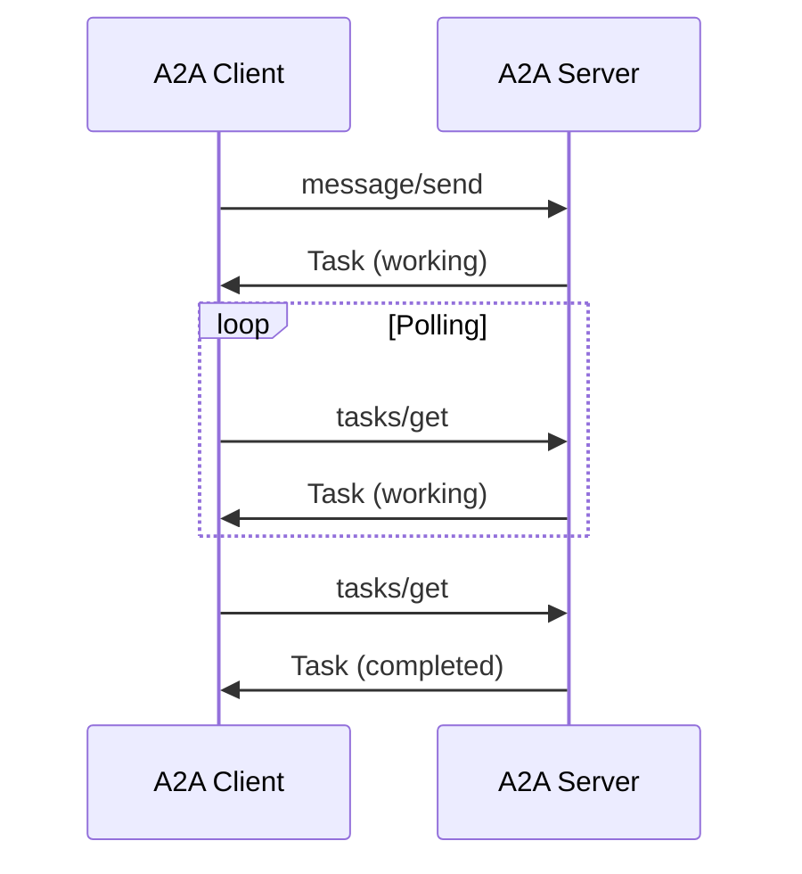
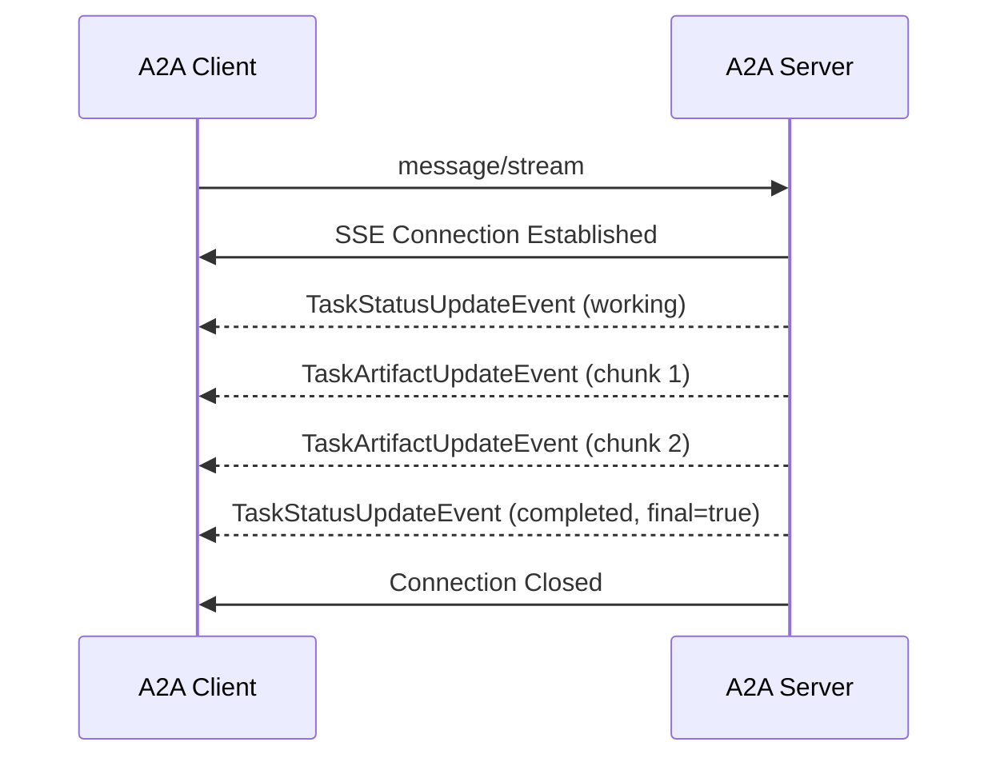
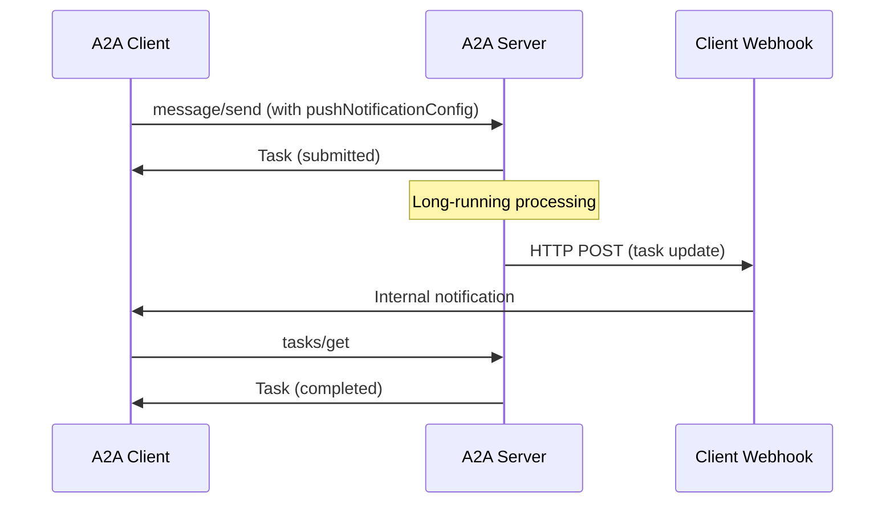
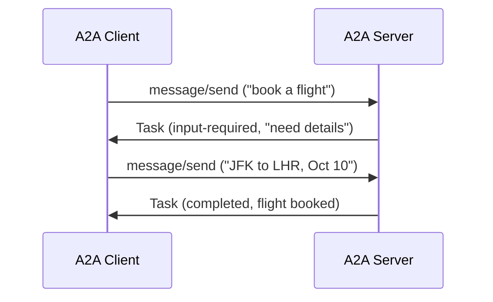

# Google Agent-to-Agent (A2A) Protocol: Comprehensive Technical Analysis

## Executive Summary

The Google Agent-to-Agent (A2A) Protocol v0.2.1 is a sophisticated, enterprise-ready standard designed to enable seamless communication and collaboration between independent AI agent systems. This analysis provides a comprehensive examination of the protocol's technical architecture, implementation requirements, and strategic implications for building interoperable agent ecosystems.

## Table of Contents

1. [Protocol Overview](#protocol-overview)
2. [Core Architecture and Design Principles](#core-architecture-and-design-principles)
3. [Technical Specification Deep Dive](#technical-specification-deep-dive)
4. [Data Models and Objects](#data-models-and-objects)
5. [Communication Patterns and Workflows](#communication-patterns-and-workflows)
6. [Security Architecture](#security-architecture)
7. [Enterprise Integration](#enterprise-integration)
8. [Implementation Analysis](#implementation-analysis)
9. [Comparison with Other Protocols](#comparison-with-other-protocols)
10. [Gap Analysis and Recommendations](#gap-analysis-and-recommendations)

---

## Protocol Overview

### Purpose and Vision

A2A addresses the fundamental challenge of agent interoperability in a world where AI agents are built using diverse frameworks (LangGraph, CrewAI, Semantic Kernel, custom solutions) and by different vendors. The protocol enables:

- **Collaborative Agent Scenarios**: Agents can delegate sub-tasks, exchange information, and coordinate actions
- **Secure Opaque Operation**: Agents interact without sharing internal memory, tools, or proprietary logic
- **Complex Workflow Orchestration**: Multi-agent systems can solve problems that single agents cannot
- **Enterprise-Grade Security**: Built on established web security practices and standards

### Key Goals

1. **Interoperability**: Bridge communication gaps between disparate agentic systems
2. **Collaboration**: Enable task delegation, context exchange, and coordinated problem-solving
3. **Discovery**: Dynamic capability discovery and understanding between agents
4. **Flexibility**: Support for synchronous, streaming, and asynchronous interaction modes
5. **Security**: Enterprise-ready security patterns using standard web practices
6. **Asynchronicity**: Native support for long-running tasks and human-in-the-loop scenarios

---

## Core Architecture and Design Principles

### Architectural Philosophy

A2A follows several key design principles that distinguish it from other agent communication protocols:

#### 1. **Simple and Standards-Based**
- **HTTP(S) Transport**: Leverages ubiquitous HTTP infrastructure
- **JSON-RPC 2.0**: Well-established RPC protocol for method invocation
- **Server-Sent Events (SSE)**: Standard streaming mechanism for real-time updates
- **Standard Authentication**: OAuth 2.0, OpenID Connect, API Keys, Bearer tokens

#### 2. **Enterprise-Ready from the Ground Up**
- **Authentication/Authorization**: Delegated to standard web security mechanisms
- **Privacy**: Strict data handling and minimization principles
- **Tracing**: Built-in support for distributed tracing (OpenTelemetry)
- **Monitoring**: Standard HTTP-based observability patterns

#### 3. **Async-First Design**
- **Long-Running Tasks**: Native support for tasks lasting minutes, hours, or days
- **Human-in-the-Loop**: Built-in support for human intervention workflows
- **Multiple Interaction Modes**: Request/response, streaming, push notifications

#### 4. **Modality Agnostic**
- **Rich Content Types**: Text, audio/video, structured data, embedded UI components
- **File Handling**: Both inline (base64) and reference-based (URI) file transfer
- **Extensible Parts**: Plugin architecture for custom content types

#### 5. **Opaque Execution Model**
- **Capability-Based Interaction**: Agents collaborate based on declared capabilities
- **Information Exchange**: Context sharing without internal state exposure
- **Security Isolation**: Agents remain independent and secure

### Core Actors

The A2A ecosystem consists of three primary actors:

1. **User**: End user (human or automated service) initiating requests
2. **A2A Client (Client Agent)**: Agent acting on behalf of user to request actions
3. **A2A Server (Remote Agent)**: Agent exposing HTTP endpoint implementing A2A protocol

---

## Technical Specification Deep Dive

### Transport and Format

#### Transport Protocol
- **Mandatory HTTPS**: All production communication must use HTTPS
- **TLS Requirements**: TLS 1.2+ with strong cipher suites
- **Certificate Validation**: Client must verify server TLS certificates

#### Data Format
- **JSON-RPC 2.0**: All requests/responses use JSON-RPC 2.0 format
- **Content-Type**: `application/json` for RPC payloads
- **SSE Streaming**: `text/event-stream` for real-time updates

#### Streaming Transport (Server-Sent Events)
- **HTTP 200 OK**: Successful streaming connection
- **Event Structure**: Each SSE data field contains complete JSON-RPC 2.0 Response
- **Connection Management**: Server controls connection lifecycle

### Authentication and Authorization Architecture

#### Transport Security
- **HTTPS Mandate**: Required for all production deployments
- **Modern TLS**: TLS 1.2+ recommended with strong cipher suites
- **Identity Verification**: Certificate validation against trusted CAs

#### Authentication Process
1. **Discovery**: Client discovers server requirements via Agent Card
2. **Credential Acquisition**: Client obtains credentials out-of-band
3. **Transmission**: Credentials sent via standard HTTP headers
4. **Validation**: Server authenticates every request

#### Supported Authentication Schemes
- **Bearer Tokens**: OAuth 2.0, JWT tokens
- **API Keys**: Custom API key schemes
- **Basic Auth**: Username/password authentication
- **OpenID Connect**: Standard identity layer

#### Authorization Model
- **Server-Controlled**: Authorization logic is server implementation-specific
- **Granular Control**: Can be applied per-skill, per-action, or per-data
- **Principle of Least Privilege**: Minimum necessary permissions
- **OAuth Scopes**: Fine-grained permission control

---

## Data Models and Objects

### Core Data Structures

#### Task Object
```typescript
interface Task {
  id: string;                    // Unique server-generated identifier
  contextId: string;             // Contextual alignment ID
  status: TaskStatus;            // Current state and message
  history?: Message[];           // Optional message history
  artifacts?: Artifact[];        // Generated outputs
  metadata?: Record<string, any>; // Extension metadata
  kind: "task";                  // Type discriminator
}
```

#### TaskStatus Object
```typescript
interface TaskStatus {
  state: TaskState;              // Current lifecycle state
  message?: Message;             // Optional context message
  timestamp?: string;            // ISO 8601 timestamp
}
```

#### TaskState Enum
- **submitted**: Task received and acknowledged
- **working**: Actively being processed
- **input-required**: Paused, waiting for additional input
- **completed**: Successfully finished
- **canceled**: Canceled by request or policy
- **failed**: Terminated due to error
- **rejected**: Rejected by remote agent
- **auth-required**: Waiting for additional authentication
- **unknown**: State cannot be determined

#### Message Object
```typescript
interface Message {
  role: "user" | "agent";        // Sender identification
  parts: Part[];                 // Content parts array
  metadata?: Record<string, any>; // Message-specific metadata
  extensions?: string[];         // Contributing extension URIs
  referenceTaskIds?: string[];   // Referenced task contexts
  messageId: string;             // Unique message identifier
  taskId?: string;               // Associated task ID
  contextId?: string;            // Context association
  kind: "message";               // Type discriminator
}
```

#### Part Union Type
```typescript
type Part = TextPart | FilePart | DataPart;

interface TextPart {
  kind: "text";
  text: string;
  metadata?: Record<string, any>;
}

interface FilePart {
  kind: "file";
  file: FileWithBytes | FileWithUri;
  metadata?: Record<string, any>;
}

interface DataPart {
  kind: "data";
  data: Record<string, any>;
  metadata?: Record<string, any>;
}
```

#### Artifact Object
```typescript
interface Artifact {
  artifactId: string;            // Unique artifact identifier
  name?: string;                 // Descriptive name
  description?: string;          // Human-readable description
  parts: Part[];                 // Content parts
  metadata?: Record<string, any>; // Artifact metadata
  extensions?: string[];         // Contributing extensions
}
```

### Agent Discovery Objects

#### Agent Card Structure
```typescript
interface AgentCard {
  name: string;                          // Human-readable name
  description: string;                   // Agent description
  url: string;                          // Service endpoint URL
  iconUrl?: string;                     // Agent icon URL
  provider?: AgentProvider;             // Provider information
  version: string;                      // Agent version
  documentationUrl?: string;            // Documentation URL
  capabilities: AgentCapabilities;      // Supported features
  securitySchemes?: Record<string, SecurityScheme>; // Auth schemes
  security?: Record<string, string[]>[]; // Security requirements
  defaultInputModes: string[];          // Accepted input types
  defaultOutputModes: string[];         // Produced output types
  skills: AgentSkill[];                 // Available capabilities
  supportsAuthenticatedExtendedCard?: boolean; // Extended card support
}
```

#### Agent Capabilities
```typescript
interface AgentCapabilities {
  streaming?: boolean;               // SSE streaming support
  pushNotifications?: boolean;       // Push notification support
  stateTransitionHistory?: boolean;  // Task history tracking
  extensions?: AgentExtension[];     // Supported extensions
}
```

#### Agent Skill Definition
```typescript
interface AgentSkill {
  id: string;                    // Unique skill identifier
  name: string;                  // Human-readable name
  description: string;           // Detailed description
  tags: string[];               // Discovery keywords
  examples?: string[];          // Usage examples
  inputModes?: string[];        // Accepted input types
  outputModes?: string[];       // Produced output types
}
```

---

## Communication Patterns and Workflows

### RPC Methods Overview

#### Core Messaging Methods

1. **message/send**
   - **Purpose**: Synchronous message sending with polling
   - **Parameters**: MessageSendParams
   - **Response**: Task | Message
   - **Use Case**: Quick requests, polling-based updates

2. **message/stream**
   - **Purpose**: Streaming message with real-time updates
   - **Parameters**: MessageSendParams
   - **Response**: SSE stream of SendStreamingMessageResponse
   - **Use Case**: Long-running tasks, real-time progress

#### Task Management Methods

3. **tasks/get**
   - **Purpose**: Retrieve current task state
   - **Parameters**: TaskQueryParams
   - **Response**: Task
   - **Use Case**: Polling for task updates

4. **tasks/cancel**
   - **Purpose**: Cancel ongoing task
   - **Parameters**: TaskIdParams
   - **Response**: Task
   - **Use Case**: User-initiated cancellation

#### Push Notification Methods

5. **tasks/pushNotificationConfig/set**
   - **Purpose**: Configure push notifications
   - **Parameters**: TaskPushNotificationConfig
   - **Response**: TaskPushNotificationConfig
   - **Use Case**: Long-running disconnected scenarios

6. **tasks/pushNotificationConfig/get**
   - **Purpose**: Retrieve notification configuration
   - **Parameters**: TaskIdParams
   - **Response**: TaskPushNotificationConfig
   - **Use Case**: Configuration verification

7. **tasks/resubscribe**
   - **Purpose**: Reconnect to SSE stream
   - **Parameters**: TaskIdParams
   - **Response**: SSE stream
   - **Use Case**: Connection recovery

#### Discovery Methods

8. **agent/authenticatedExtendedCard**
   - **Purpose**: Retrieve detailed agent card
   - **Method**: HTTP GET (not JSON-RPC)
   - **Response**: AgentCard
   - **Use Case**: Authenticated detailed discovery

### Interaction Patterns

#### 1. Request/Response (Synchronous)


#### 2. Streaming (Server-Sent Events)


#### 3. Push Notifications (Asynchronous)


#### 4. Multi-Turn Interaction


### Error Handling

#### Standard JSON-RPC Errors
- **-32700**: Parse error (invalid JSON)
- **-32600**: Invalid request (malformed JSON-RPC)
- **-32601**: Method not found
- **-32602**: Invalid parameters
- **-32603**: Internal server error

#### A2A-Specific Errors
- **-32001**: TaskNotFoundError
- **-32002**: TaskNotCancelableError
- **-32003**: PushNotificationNotSupportedError
- **-32004**: UnsupportedOperationError
- **-32005**: ContentTypeNotSupportedError
- **-32006**: InvalidAgentResponseError

---

## Security Architecture

### Multi-Layer Security Model

#### Transport Layer Security
1. **HTTPS Mandatory**: All communication must use HTTPS in production
2. **TLS Configuration**: Modern TLS versions (1.2+) with strong cipher suites
3. **Certificate Validation**: Strict certificate chain validation

#### Authentication Layer
1. **Scheme Declaration**: Agent Card declares supported authentication schemes
2. **Credential Acquisition**: Out-of-band credential obtaining process
3. **Header-Based Transmission**: Standard HTTP authentication headers
4. **Server Validation**: Mandatory authentication of every request

#### Authorization Layer
1. **Identity-Based Control**: Authorization based on authenticated identity
2. **Skill-Level Permissions**: Granular control per agent skill
3. **Data-Level Security**: Protection of sensitive data access
4. **Least Privilege**: Minimum necessary permissions

#### Push Notification Security

##### Server Security (Outbound)
1. **URL Validation**: Prevent SSRF attacks through URL allowlisting
2. **Ownership Verification**: Challenge-response validation of webhook URLs
3. **Authentication**: Server must authenticate to client webhook
4. **Network Controls**: Egress firewall restrictions

##### Client Security (Inbound)
1. **Server Authentication**: Verify notification source authenticity
2. **Signature Validation**: HMAC or JWT signature verification
3. **Replay Protection**: Timestamp and nonce validation
4. **Key Management**: Secure key rotation and management

### Security Best Practices

#### Data Privacy and Confidentiality
- **Sensitivity Awareness**: Careful handling of sensitive data in Messages/Artifacts
- **Regulatory Compliance**: GDPR, CCPA, HIPAA compliance as applicable
- **Data Minimization**: Avoid unnecessary sensitive information exchange
- **Secure Storage**: Protect data at rest according to enterprise policies

#### Observability and Monitoring
- **Distributed Tracing**: OpenTelemetry integration for end-to-end visibility
- **Comprehensive Logging**: Detailed logs with correlation IDs
- **Metrics Collection**: Operational metrics for performance monitoring
- **Audit Trails**: Security event logging and analysis

---

## Enterprise Integration

### API Management Integration

#### Gateway Integration
- **Centralized Policy Enforcement**: Consistent security, rate limiting, quotas
- **Traffic Management**: Load balancing, routing, mediation
- **Analytics**: Usage insights, performance metrics, trend analysis
- **Developer Portals**: Agent discovery, documentation, onboarding

#### Observability Integration
- **Monitoring Systems**: Prometheus, Google Cloud Monitoring integration
- **Alerting**: Performance and error rate alerting
- **Dashboards**: Operational visibility and capacity planning
- **SLA Monitoring**: Service level agreement tracking

### Identity and Access Management

#### OAuth 2.0 Integration
- **Authorization Code Flow**: Interactive user authentication
- **Client Credentials Flow**: Service-to-service authentication
- **JWT Tokens**: Standardized token format with claims
- **Scope-Based Permissions**: Fine-grained authorization control

#### Enterprise Identity Providers
- **Active Directory**: Microsoft AD integration
- **LDAP**: Lightweight Directory Access Protocol support
- **SAML**: Security Assertion Markup Language integration
- **Custom Providers**: Extensible authentication architecture

---

## Implementation Analysis

### Technology Stack Requirements

#### Core Dependencies
- **HTTP/HTTPS Client**: Robust HTTP client with TLS support
- **JSON-RPC 2.0**: JSON-RPC request/response handling
- **Server-Sent Events**: SSE client/server implementation
- **JSON Processing**: Efficient JSON parsing and serialization

#### Security Dependencies
- **TLS Implementation**: Modern TLS with certificate validation
- **Authentication Libraries**: OAuth 2.0, JWT, API key handling
- **Cryptographic Libraries**: HMAC, signature verification
- **Certificate Management**: X.509 certificate handling

#### Optional Components
- **Webhook Server**: For push notification receiving
- **Distributed Tracing**: OpenTelemetry instrumentation
- **Metrics Collection**: Prometheus client libraries
- **Registry Client**: For agent discovery via catalogs

### Implementation Complexity Analysis

#### Low Complexity (Basic Implementation)
- **Simple Request/Response**: Basic message/send functionality
- **Static Agent Cards**: Hardcoded agent discovery
- **Basic Authentication**: API key or basic auth
- **Text-Only Messages**: Simple text part handling

#### Medium Complexity (Production Ready)
- **Streaming Support**: SSE implementation with reconnection
- **File Handling**: Both inline and URI-based file transfer
- **Dynamic Discovery**: Well-known URI or registry-based discovery
- **OAuth Integration**: Standard OAuth 2.0 flows

#### High Complexity (Enterprise Grade)
- **Push Notifications**: Full webhook infrastructure with security
- **Advanced Security**: mTLS, JWKS, signature validation
- **Observability**: Full tracing, metrics, and logging
- **Registry Integration**: Custom discovery mechanisms

### Performance Considerations

#### Scalability Factors
- **Connection Management**: HTTP connection pooling and reuse
- **Streaming Overhead**: SSE connection resource management
- **Webhook Processing**: Asynchronous notification handling
- **Task State Management**: Efficient task storage and retrieval

#### Optimization Strategies
- **Caching**: Agent Card caching with TTL
- **Compression**: HTTP compression for large payloads
- **Connection Pooling**: Reuse of HTTP connections
- **Async Processing**: Non-blocking I/O for high throughput

---

## Comparison with Other Protocols

### A2A vs. Model Context Protocol (MCP)

#### Complementary Nature
- **MCP Focus**: Agent-to-tool/resource communication
- **A2A Focus**: Agent-to-agent peer communication
- **Integration**: A2A agents can use MCP for tool access
- **Scope**: Different layers of the agent architecture stack

#### Key Differences
| Aspect | A2A | MCP |
|--------|-----|-----|
| **Purpose** | Agent collaboration | Tool integration |
| **Transport** | HTTP/JSON-RPC | stdio/WebSocket |
| **Security** | Enterprise web standards | Process-level security |
| **Discovery** | Agent Cards | Tool manifests |
| **Async** | Native long-running tasks | Synchronous tool calls |

### A2A vs. Traditional RPC Protocols

#### Advantages over gRPC
- **Web-Native**: Built on HTTP/JSON standards
- **Firewall Friendly**: Standard HTTP traffic
- **Browser Compatible**: Direct web application integration
- **Streaming**: Standard SSE instead of custom streaming

#### Advantages over REST
- **Method-Oriented**: Clear RPC semantics
- **Standardized**: Consistent JSON-RPC 2.0 format
- **Error Handling**: Structured error responses
- **Batching**: Potential for request batching

### A2A vs. Message Queues

#### Complementary Use Cases
- **A2A**: Synchronous and streaming interactions
- **Message Queues**: Asynchronous event processing
- **Integration**: A2A can trigger message queue workflows
- **Reliability**: Different consistency guarantees

---

## Gap Analysis and Recommendations

### Current PyGent Factory A2A Infrastructure Assessment

Based on the codebase analysis, the current state includes:

#### Existing Components
1. **Agent Base Classes**: Basic agent structure in `src/core/agent/base.py`
2. **Orchestration**: Some coordination logic in `src/orchestration/`
3. **WebSocket Support**: Real-time communication in `src/api/routes/websocket.py`
4. **Agent Factory**: Agent creation and management in `src/core/agent_factory.py`

#### Missing A2A Components
1. **Agent Card Implementation**: No standardized agent self-description
2. **JSON-RPC 2.0 Support**: Current implementation uses WebSocket messaging
3. **Task State Management**: No A2A-compliant task lifecycle management
4. **Discovery Mechanisms**: No agent discovery infrastructure
5. **Authentication Integration**: Limited enterprise authentication support
6. **Push Notification System**: No webhook-based notification system

### Implementation Roadmap

#### Phase 1: Core A2A Infrastructure (4-6 weeks)
1. **JSON-RPC 2.0 Server**: Implement A2A-compliant HTTP endpoint
2. **Agent Card System**: Create agent self-description and discovery
3. **Task Management**: Implement A2A task lifecycle and state management
4. **Basic Authentication**: OAuth 2.0 and API key support

#### Phase 2: Advanced Features (6-8 weeks)
1. **Streaming Support**: Server-Sent Events implementation
2. **File Handling**: Part system with file transfer capabilities
3. **Push Notifications**: Webhook system for long-running tasks
4. **Agent Discovery**: Registry integration and well-known URI support

#### Phase 3: Enterprise Integration (4-6 weeks)
1. **Security Hardening**: Advanced authentication and authorization
2. **Observability**: Distributed tracing and metrics collection
3. **API Management**: Gateway integration and policy enforcement
4. **Testing and Validation**: Comprehensive test suite and compliance verification

### Technical Recommendations

#### Architecture Decisions
1. **Dual Protocol Support**: Maintain WebSocket for internal communication, add A2A for external
2. **Agent Card Registry**: Implement local registry with future federation support
3. **Task Persistence**: Use existing database infrastructure for task state
4. **Security Integration**: Leverage existing authentication where possible

#### Implementation Priorities
1. **Start with Basic A2A**: Focus on message/send and tasks/get methods
2. **Gradual Migration**: Implement A2A alongside existing systems
3. **Tool Integration**: Use A2A for inter-agent communication, MCP for tool access
4. **Testing Strategy**: Extensive integration testing with existing agent framework

### Success Metrics

#### Technical Metrics
- **Compliance**: 100% A2A specification compliance
- **Performance**: <100ms latency for basic operations
- **Reliability**: 99.9% availability for A2A endpoints
- **Security**: Zero security vulnerabilities in implementation

#### Business Metrics
- **Interoperability**: Successful communication with external A2A agents
- **Developer Experience**: Reduced integration time for new agents
- **Scalability**: Support for 1000+ concurrent agent interactions
- **Enterprise Adoption**: Integration with existing enterprise systems

---

## Conclusion

The Google A2A Protocol represents a significant advancement in agent interoperability, providing a comprehensive, enterprise-ready standard for agent-to-agent communication. Its design principles of simplicity, security, and standards-compliance make it an ideal choice for building scalable agent ecosystems.

For PyGent Factory, implementing A2A compliance will:

1. **Enable External Integration**: Connect with agents built on other platforms
2. **Improve Security**: Leverage enterprise-grade security patterns
3. **Enhance Scalability**: Support for long-running and distributed workflows
4. **Future-Proof Architecture**: Align with emerging industry standards

The implementation roadmap provides a clear path to A2A compliance while maintaining compatibility with existing systems. The phased approach allows for gradual adoption and risk mitigation while building toward full compliance.

The investment in A2A implementation will position PyGent Factory as a leader in agent interoperability and enable participation in the broader agent ecosystem that Google and the industry are building.

---

*This analysis is based on the A2A Protocol Specification v0.2.1 and reflects the current state of the protocol as of January 2025.*
