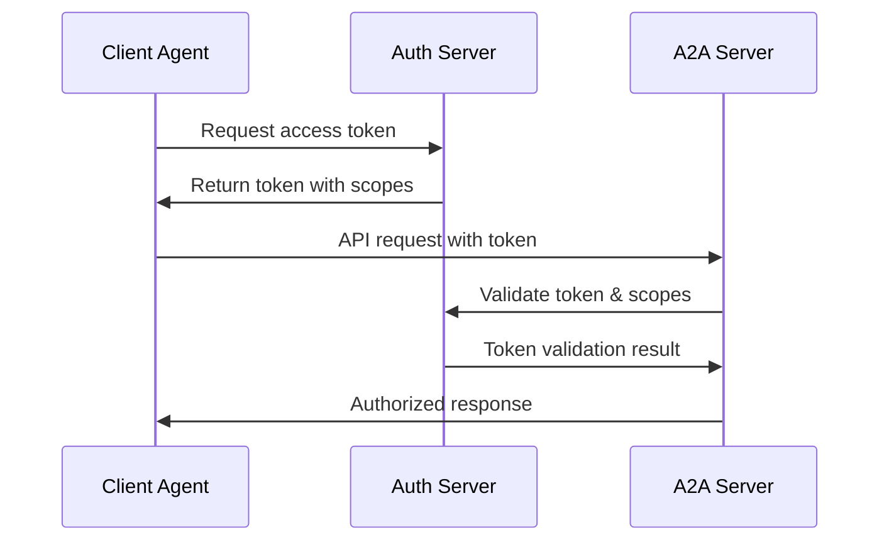

# A2A Protocol Security Overview

## Overview

This document provides an overview of the comprehensive security specifications for the A2A Protocol v0.2.1, covering the multi-layer security architecture and enterprise security requirements.

## Multi-Layer Security Architecture

The A2A protocol implements a comprehensive security model with multiple layers of protection:

### 1. Transport Security
- **Mandatory HTTPS**: TLS 1.2+ required for production deployments
- **Certificate Validation**: Full CA trust chain verification
- **Cipher Suite Requirements**: Strong encryption algorithms only
- **Perfect Forward Secrecy**: Ephemeral key exchange protocols

**TLS Configuration Example**:
```yaml
tls:
  min_version: "1.2"
  cipher_suites:
    - "TLS_ECDHE_RSA_WITH_AES_256_GCM_SHA384"
    - "TLS_ECDHE_RSA_WITH_AES_128_GCM_SHA256"
    - "TLS_ECDHE_RSA_WITH_CHACHA20_POLY1305"
  certificate_validation: strict
  verify_client_cert: true
```

### 2. Authentication Layer
- **Standard HTTP Authentication**: OAuth 2.0, API Keys, Basic Auth
- **Token-based Authentication**: JWT and bearer tokens
- **Multi-factor Authentication**: Support for MFA flows
- **Certificate-based Authentication**: Client certificate support

**Supported Authentication Methods**:
```json
{
  "authentication": {
    "oauth2": {
      "flows": ["authorization_code", "client_credentials"],
      "scopes": ["read", "write", "admin"]
    },
    "api_key": {
      "header": "X-API-Key",
      "query_param": "api_key"
    },
    "basic": {
      "realm": "A2A Protocol"
    },
    "bearer": {
      "format": "JWT"
    }
  }
}
```

### 3. Authorization Layer
- **Server-side Policy Enforcement**: Centralized authorization decisions
- **Least Privilege Principle**: Minimal required permissions
- **Scope-based Access Control**: Fine-grained permission scopes
- **Resource-level Permissions**: Per-resource access controls

**Authorization Flow**:


### 4. Input Validation
- **Schema Validation**: Strict JSON-RPC parameter validation
- **Content Sanitization**: Safe handling of user-provided content
- **File Type Restrictions**: Controlled file upload and processing
- **Size Limits**: Protection against oversized requests

**Validation Rules**:
```python
validation_rules = {
    "message_max_size": "10MB",
    "file_types_allowed": ["text/plain", "application/json", "image/png", "image/jpeg"],
    "string_max_length": 65536,
    "array_max_items": 1000,
    "object_max_properties": 100,
    "sanitization": {
        "html_tags": "strip",
        "script_content": "reject",
        "sql_injection": "detect_and_reject"
    }
}
```

### 5. Resource Management
- **Rate Limiting**: Request frequency controls
- **Concurrency Limits**: Maximum concurrent connections
- **Resource Quotas**: CPU, memory, and storage limits
- **Timeout Controls**: Request and task execution timeouts

**Resource Limits**:
```yaml
resource_limits:
  rate_limiting:
    requests_per_minute: 1000
    burst_limit: 100
  concurrency:
    max_connections: 50
    max_concurrent_requests: 20
  quotas:
    cpu_percent_max: 80
    memory_mb_max: 1024
    storage_mb_max: 5120
  timeouts:
    request_timeout_seconds: 30
    task_timeout_seconds: 300
```

## Security Implementation Layers

### Protocol Level Security
- **JSON-RPC 2.0 Security**: Secure message formatting and validation
- **Message Integrity**: Cryptographic signing and verification
- **Replay Protection**: Nonce and timestamp validation
- **Message Encryption**: End-to-end encryption for sensitive data

### API Level Security
- **Endpoint Protection**: Per-endpoint security policies
- **Parameter Validation**: Input sanitization and type checking
- **Output Filtering**: Sensitive data redaction
- **Audit Logging**: Comprehensive security event logging

### Application Level Security
- **Business Logic Validation**: Domain-specific security rules
- **Data Access Controls**: Fine-grained data permissions
- **Session Management**: Secure session handling
- **Error Handling**: Secure error responses without information leakage

## Security Configuration

### Basic Security Configuration
```python
security_config = {
    "authentication": {
        "required": True,
        "methods": ["oauth2", "api_key"],
        "token_expiry": 3600,  # 1 hour
        "refresh_enabled": True
    },
    "authorization": {
        "enforce_scopes": True,
        "default_scope": "read",
        "admin_scope": "admin",
        "resource_based": True
    },
    "transport": {
        "https_only": True,
        "tls_version": "1.2+",
        "cert_validation": True
    },
    "validation": {
        "strict_schemas": True,
        "content_sanitization": True,
        "size_limits": True
    }
}
```

### Enterprise Security Configuration
```python
enterprise_security_config = {
    "multi_factor_auth": {
        "enabled": True,
        "methods": ["totp", "sms", "email"],
        "grace_period": 300  # 5 minutes
    },
    "audit_logging": {
        "enabled": True,
        "log_level": "INFO",
        "include_payloads": False,  # Privacy protection
        "retention_days": 90
    },
    "threat_detection": {
        "enabled": True,
        "anomaly_detection": True,
        "intrusion_detection": True,
        "automated_response": True
    },
    "compliance": {
        "gdpr": True,
        "hipaa": True,
        "sox": True,
        "data_classification": True
    }
}
```

## Security Monitoring

### Real-time Security Monitoring
```python
class SecurityMonitor:
    """Real-time security monitoring for A2A protocol"""
    
    def __init__(self, config: Dict[str, Any]):
        self.config = config
        self.threat_detector = ThreatDetector()
        self.audit_logger = AuditLogger()
    
    async def monitor_request(self, request: A2ARequest) -> SecurityAssessment:
        """Monitor and assess security of incoming request"""
        
        assessment = SecurityAssessment()
        
        # Authentication validation
        auth_result = await self._validate_authentication(request)
        assessment.authentication_valid = auth_result.valid
        
        # Authorization check
        authz_result = await self._check_authorization(request)
        assessment.authorization_granted = authz_result.granted
        
        # Threat detection
        threat_score = await self.threat_detector.assess_threat(request)
        assessment.threat_score = threat_score
        
        # Audit logging
        await self.audit_logger.log_request(request, assessment)
        
        return assessment
```

### Security Metrics Collection
```python
security_metrics = {
    "authentication_failures": "counter",
    "authorization_denials": "counter",
    "threat_detections": "counter",
    "rate_limit_violations": "counter",
    "request_validation_failures": "counter",
    "security_incidents": "counter",
    "response_time_security_checks": "histogram",
    "active_authenticated_sessions": "gauge"
}
```

## Threat Mitigation

### Common Threats and Mitigations

| Threat | Mitigation Strategy | Implementation |
|--------|-------------------|---------------|
| **Man-in-the-Middle** | TLS encryption + cert pinning | HTTPS enforcement |
| **Replay Attacks** | Nonce + timestamp validation | Message-level protection |
| **Injection Attacks** | Input validation + sanitization | Schema enforcement |
| **DDoS Attacks** | Rate limiting + load balancing | Infrastructure controls |
| **Data Exfiltration** | Access controls + audit logging | Authorization enforcement |
| **Privilege Escalation** | Least privilege + scope validation | Permission boundaries |

### Security Incident Response
```python
class SecurityIncidentResponse:
    """Automated security incident response"""
    
    async def handle_security_incident(self, incident: SecurityIncident):
        """Handle detected security incident"""
        
        # Immediate response
        if incident.severity >= Severity.HIGH:
            await self._immediate_response(incident)
        
        # Investigation
        investigation = await self._investigate_incident(incident)
        
        # Containment
        await self._contain_threat(incident, investigation)
        
        # Recovery
        await self._recover_from_incident(incident)
        
        # Lessons learned
        await self._update_security_policies(incident, investigation)
```

## Compliance and Governance

### Regulatory Compliance
- **GDPR**: Data protection and privacy controls
- **HIPAA**: Healthcare data security requirements
- **SOX**: Financial data integrity controls
- **PCI DSS**: Payment card data protection

### Security Governance
- **Policy Management**: Centralized security policy definition
- **Risk Assessment**: Regular security risk evaluations
- **Vulnerability Management**: Systematic vulnerability remediation
- **Security Training**: Ongoing security awareness programs

## Best Practices

### Implementation Best Practices
1. **Defense in Depth**: Multiple security layers
2. **Zero Trust**: Never trust, always verify
3. **Principle of Least Privilege**: Minimal required access
4. **Secure by Default**: Secure default configurations
5. **Regular Audits**: Continuous security assessments

### Operational Best Practices
1. **Regular Updates**: Keep security components current
2. **Monitoring**: Continuous security monitoring
3. **Incident Response**: Prepared incident response procedures
4. **Backup and Recovery**: Secure backup and recovery procedures
5. **Documentation**: Comprehensive security documentation

## Related Documentation

- [A2A_SECURITY_AUTHENTICATION.md](A2A_SECURITY_AUTHENTICATION.md) - Authentication methods and flows
- [A2A_SECURITY_AUTHORIZATION.md](A2A_SECURITY_AUTHORIZATION.md) - Authorization and access control
- [A2A_SECURITY_MONITORING.md](A2A_SECURITY_MONITORING.md) - Security monitoring and incident response
- [A2A_PROTOCOL_IMPLEMENTATION_GUIDE.md](A2A_PROTOCOL_IMPLEMENTATION_GUIDE.md) - Implementation guidelines
