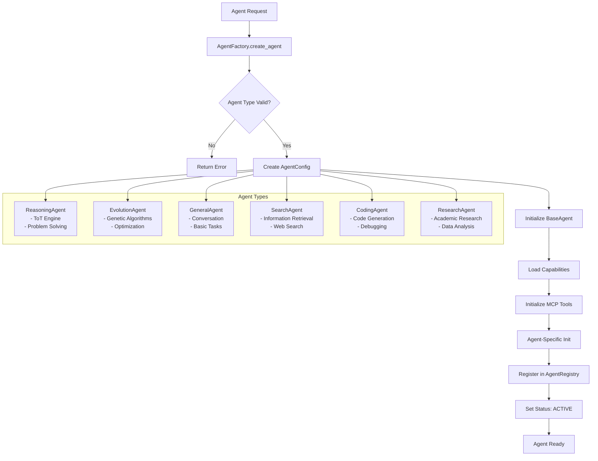
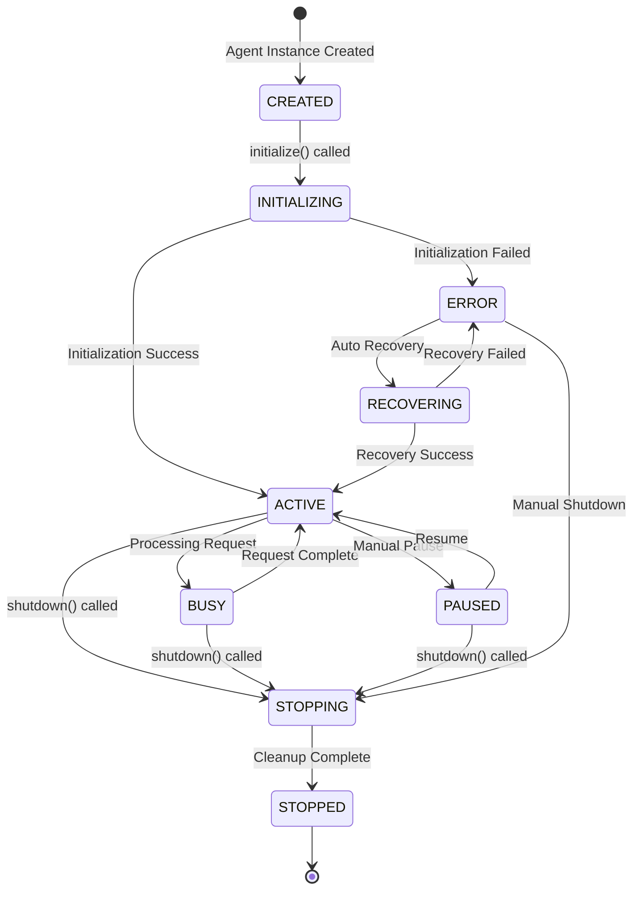
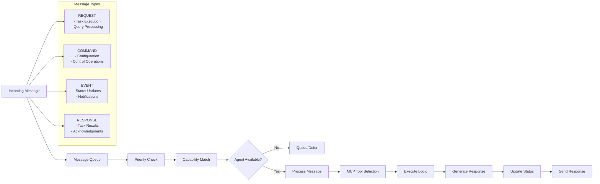
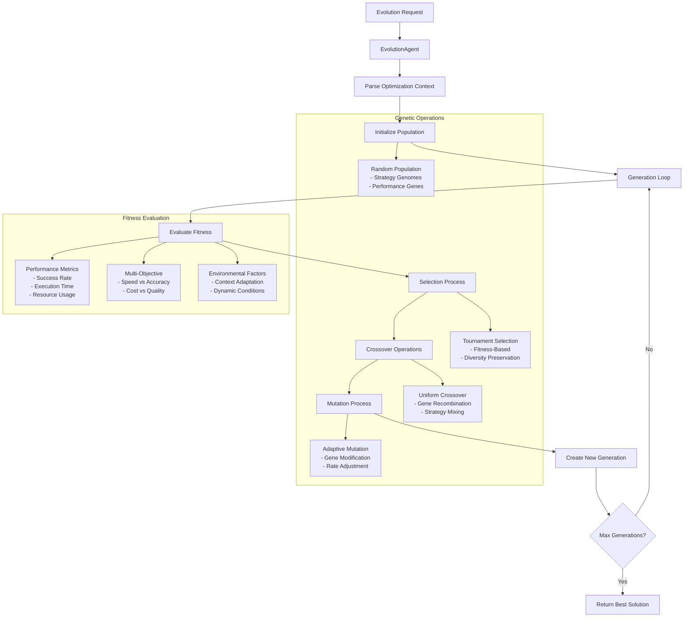
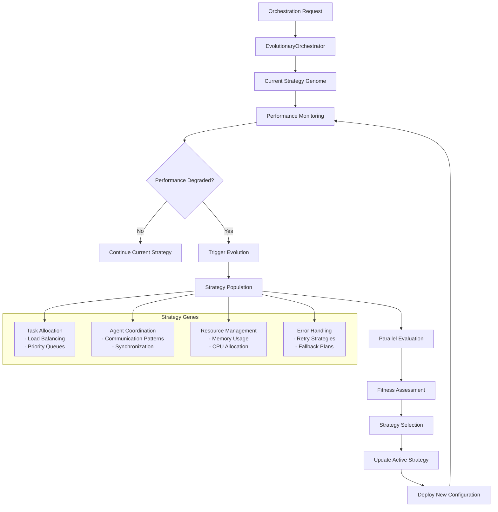
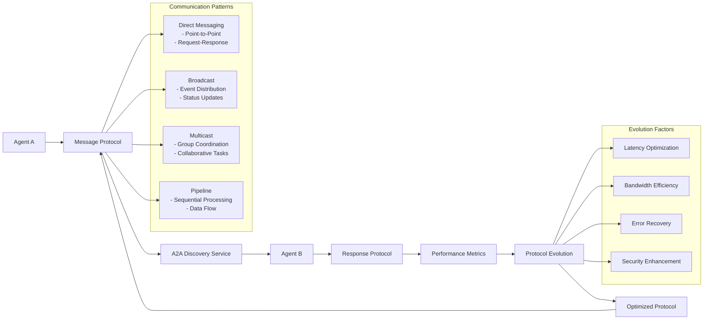
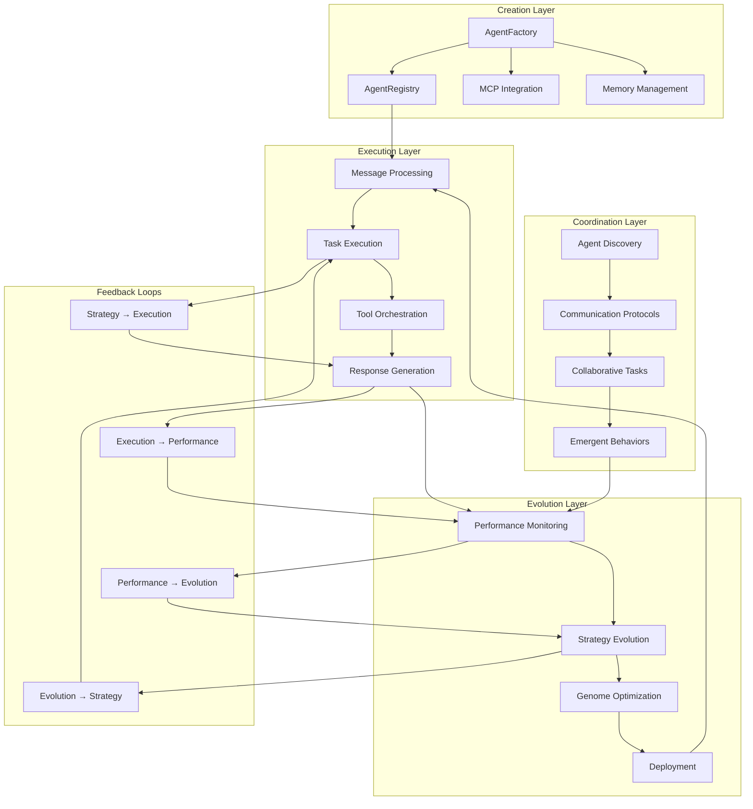

# Agent Creation and Evolution Workflow

## Overview
This diagram shows the complete workflow for agent creation, lifecycle management, and evolutionary optimization in the PyGent Factory system.

## 1. Agent Creation Workflow

## 2. Agent Lifecycle Management

## 3. Agent Message Processing Pipeline

## 4. Evolution System Workflow

## 5. Evolutionary Orchestration System

## 6. Agent-to-Agent (A2A) Communication Evolution

## 7. Complete System Integration

## Key Features

### Agent Creation Process
1. **Request Validation**: Validates agent type and configuration
2. **Template Application**: Uses predefined templates for agent types
3. **Capability Loading**: Registers agent-specific capabilities
4. **MCP Integration**: Connects to available MCP tools
5. **Registry Management**: Tracks all active agents

### Lifecycle Management
- **Status Tracking**: Real-time status monitoring and transitions
- **Resource Management**: Concurrent task limits and memory usage
- **Error Recovery**: Automatic recovery from failures
- **Graceful Shutdown**: Clean resource cleanup

### Evolution System
- **Genetic Algorithms**: Population-based optimization
- **Multi-Objective Fitness**: Balances speed, accuracy, and resources
- **Adaptive Strategies**: Self-improving coordination patterns
- **Performance Feedback**: Continuous optimization based on results

### A2A Communication
- **Discovery Service**: Automatic peer agent discovery
- **Protocol Evolution**: Self-optimizing communication patterns
- **Quality of Service**: Guaranteed delivery and performance
- **Emergent Coordination**: Spontaneous collaborative behaviors

This workflow shows how agents are born, live, work, evolve, and coordinate in a continuous cycle of improvement and adaptation.
