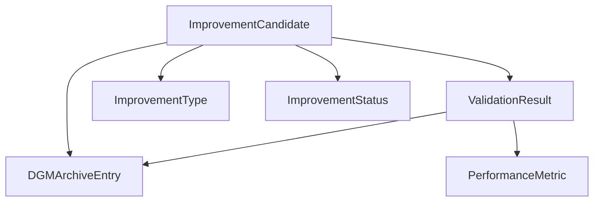

# Darwin Gödel Machine (DGM) - Data Models Specification

## Overview

This document defines the core data models and types used in the Darwin Gödel Machine self-improvement system. These models form the foundation for all DGM operations including improvement candidate generation, validation, and archival.

## Core Models

### ImprovementType Enum

Defines the categories of improvements the DGM system can make:

```python
class ImprovementType(str, Enum):
    PARAMETER_TUNING = "parameter_tuning"
    ALGORITHM_MODIFICATION = "algorithm_modification" 
    ARCHITECTURE_CHANGE = "architecture_change"
    CONFIGURATION_UPDATE = "configuration_update"
```

**Types Explained:**
- **PARAMETER_TUNING**: Adjusting hyperparameters, thresholds, weights
- **ALGORITHM_MODIFICATION**: Changing algorithmic logic or approach
- **ARCHITECTURE_CHANGE**: Modifying system structure or component relationships
- **CONFIGURATION_UPDATE**: Updating configuration settings or runtime parameters

### ImprovementStatus Enum

Tracks the lifecycle status of improvement candidates:

```python
class ImprovementStatus(str, Enum):
    PROPOSED = "proposed"
    TESTING = "testing"
    VALIDATED = "validated"
    APPLIED = "applied"
    REJECTED = "rejected"
    FAILED = "failed"
```

**Status Flow:**
```
PROPOSED → TESTING → VALIDATED → APPLIED
    ↓          ↓         ↓
REJECTED   FAILED    FAILED
```

### PerformanceMetric Model

Represents measurable performance indicators:

```python
class PerformanceMetric(BaseModel):
    name: str
    value: float
    unit: str
    timestamp: datetime = Field(default_factory=datetime.utcnow)
    context: Optional[Dict[str, Any]] = None
```

**Common Metrics:**
- `response_time_ms`: Response latency in milliseconds
- `accuracy_percentage`: Task accuracy as percentage
- `throughput_per_second`: Operations per second
- `memory_usage_mb`: Memory consumption in MB
- `cpu_utilization_percent`: CPU usage percentage
- `error_rate_percent`: Error rate as percentage

### ImprovementCandidate Model

Core model representing a proposed system improvement:

```python
class ImprovementCandidate(BaseModel):
    id: str
    agent_id: str
    improvement_type: ImprovementType
    description: str
    code_changes: Dict[str, str]  # filename -> new_code
    expected_improvement: float
    risk_level: float = Field(ge=0.0, le=1.0)
    status: ImprovementStatus = ImprovementStatus.PROPOSED
    created_at: datetime = Field(default_factory=datetime.utcnow)
    updated_at: datetime = Field(default_factory=datetime.utcnow)
```

**Field Details:**
- `code_changes`: Maps file paths to their new content
- `expected_improvement`: Predicted performance gain (0.0 to 1.0)
- `risk_level`: Safety risk assessment (0.0 = safe, 1.0 = dangerous)

### ValidationResult Model

Records the outcome of empirical validation:

```python
class ValidationResult(BaseModel):
    candidate_id: str
    success: bool
    performance_before: List[PerformanceMetric]
    performance_after: List[PerformanceMetric]
    improvement_score: float
    safety_score: float = Field(ge=0.0, le=1.0)
    test_results: Dict[str, Any]
    validation_time: float  # seconds
    timestamp: datetime = Field(default_factory=datetime.utcnow)
```

**Key Fields:**
- `improvement_score`: Actual performance improvement achieved
- `safety_score`: Post-validation safety assessment
- `test_results`: Detailed test execution results

### DGMArchiveEntry Model

Historical record of all improvement attempts:

```python
class DGMArchiveEntry(BaseModel):
    id: str
    agent_id: str
    improvement_candidate: ImprovementCandidate
    validation_result: Optional[ValidationResult] = None
    applied: bool = False
    application_timestamp: Optional[datetime] = None
    rollback_info: Optional[Dict[str, Any]] = None
```

**Usage:**
- Maintains complete history of all improvements
- Enables rollback functionality
- Supports learning from past attempts

## Model Relationships



## Usage Examples

### Creating an Improvement Candidate

```python
candidate = ImprovementCandidate(
    id=str(uuid.uuid4()),
    agent_id="agent_001",
    improvement_type=ImprovementType.PARAMETER_TUNING,
    description="Optimize neural network learning rate",
    code_changes={
        "src/ai/neural_network.py": "# Updated learning rate\nLEARNING_RATE = 0.001"
    },
    expected_improvement=0.15,  # 15% improvement expected
    risk_level=0.2  # Low risk
)
```

### Recording Performance Metrics

```python
metrics = [
    PerformanceMetric(
        name="response_time_ms",
        value=234.5,
        unit="milliseconds"
    ),
    PerformanceMetric(
        name="accuracy_percentage", 
        value=94.2,
        unit="percent"
    )
]
```

### Creating Validation Result

```python
validation_result = ValidationResult(
    candidate_id=candidate.id,
    success=True,
    performance_before=baseline_metrics,
    performance_after=improved_metrics,
    improvement_score=0.12,  # 12% actual improvement
    safety_score=0.9,  # High safety
    test_results={"all_tests_passed": True, "test_count": 156},
    validation_time=45.2
)
```

## Best Practices

### Performance Metrics
- Always include timestamp and context
- Use consistent units across measurements
- Include confidence intervals where applicable
- Capture multiple metric types (latency, accuracy, throughput)

### Improvement Candidates
- Provide clear, descriptive explanations
- Keep code changes atomic and focused
- Set realistic expected improvement values
- Properly assess and set risk levels

### Validation Results
- Record comprehensive before/after metrics
- Include detailed test execution information
- Document any failures or unexpected results
- Maintain traceability to original candidate

## Integration Points

These models integrate with:
- **DGM Engine**: Core processing and orchestration
- **Code Generator**: Creates improvement candidates
- **Empirical Validator**: Produces validation results
- **Archive System**: Stores historical entries
- **Safety Monitor**: Evaluates risk levels
- **A2A Protocol**: Enables cross-agent improvement sharing

## Related Documentation

- [DGM_ENGINE_IMPLEMENTATION.md](DGM_ENGINE_IMPLEMENTATION.md) - Core engine implementation
- [DGM_COMPONENTS_GUIDE.md](DGM_COMPONENTS_GUIDE.md) - Individual component details
- [A2A_DGM_IMPLEMENTATION_COMPLETE.md](A2A_DGM_IMPLEMENTATION_COMPLETE.md) - Complete implementation status
