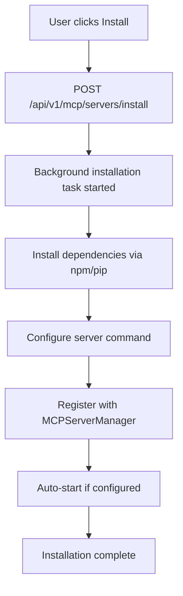

# MCP Server Auto-Detection System Analysis

## Overview
PyGent Factory implements a comprehensive MCP (Model Context Protocol) server auto-detection and management system that handles discovery, installation, configuration, and lifecycle management of MCP servers.

## How MCP Auto-Detection Works

### 1. System Architecture

The MCP auto-detection system consists of several key components:

- **MCPServerManager** (`src/mcp/server_registry.py`) - Core registry and lifecycle management
- **Real Server Loader** (`src/mcp/real_server_loader.py`) - Loads predefined server configurations
- **API Routes** (`src/api/routes/mcp.py`) - REST API for server management and discovery
- **UI Marketplace** (`src/pages/MCPMarketplacePage.tsx`) - Frontend for server discovery and installation
- **Configuration File** (`mcp_server_configs.json`) - Predefined server definitions

### 2. Discovery Process Flow

#### 2.1 Application Startup
1. **Database Initialization** - Core database connections established
2. **Vector Store Setup** - Memory and embedding services initialized
3. **MCP Manager Startup** - MCPServerManager instance created and started
4. **Real Server Loading** - Predefined servers loaded from `mcp_server_configs.json`
5. **API Route Registration** - Discovery and management endpoints activated

#### 2.2 Server Discovery Mechanisms

**A. Configuration-Based Discovery**
```javascript
// From mcp_server_configs.json
{
  "servers": [
    {
      "id": "filesystem-local",
      "name": "Local Filesystem", 
      "command": ["D:\\nodejs\\npx.cmd", "-y", "@modelcontextprotocol/server-filesystem", "."],
      "capabilities": ["file-read", "file-write", "directory-list", "file-search"],
      "transport": "stdio",
      "auto_start": true
    }
  ]
}
```

**B. Dynamic Discovery via API**
- `/api/v1/mcp/discovery/status` - Returns discovery status and results
- `/api/v1/mcp/discovery/servers` - Returns discovered servers from cache
- Cache file: `./data/mcp_cache/discovered_servers.json`

**C. Marketplace Integration**
- UI fetches discovery data via REST API
- Real-time installation status polling
- One-click server installation and configuration

### 3. Server Installation Process

#### 3.1 Installation Flow


#### 3.2 Installation Types Supported
- **NPM Packages** - `@modelcontextprotocol/server-*` and community packages
- **Git Repositories** - Direct cloning from GitHub
- **Local Servers** - Pre-built or custom servers
- **Remote MCP Servers** - Cloudflare-hosted servers via `mcp-remote`

### 4. Currently Configured Servers

Based on `mcp_server_configs.json`, the following servers are configured:

| Server | Type | Status | Priority |
|--------|------|--------|----------|
| **filesystem-local** | Core | ✅ Active | 1 |
| **fetch-mcp** | Web | ✅ Active | 2 |
| **time-mcp** | Utility | ✅ Active | 3 |
| **sequentialthinking-mcp** | Reasoning | ✅ Active | 4 |
| **memory-mcp** | Persistence | ✅ Active | 2 |
| **git-mcp** | Development | ✅ Active | 2 |
| **cloudflare-mcp** | Cloud | ✅ Active | 3 |
| **python-mcp** | Development | ⚠️ Needs verification | 1 |
| **context7** | Documentation | ✅ Active | 2 |
| **github-mcp** | Development | ✅ Active | 3 |
| **local-tools** | Utilities | 🔧 Manual | 4 |

**Note**: The `a2a-mcp` server has been removed for security reasons as requested.

### 5. Server Lifecycle Management

#### 5.1 States
- **Registered** - Server configuration loaded
- **Starting** - Server process initiating
- **Running** - Server active and responding
- **Stopped** - Server process terminated
- **Failed** - Server encountered error
- **Installing** - Background installation in progress

#### 5.2 Auto-Recovery
- Automatic restart on failure (configurable `max_restarts`)
- Health monitoring and status reporting
- Graceful shutdown and cleanup

### 6. API Endpoints

#### 6.1 Discovery APIs
```
GET /api/v1/mcp/discovery/status     # Discovery system status
GET /api/v1/mcp/discovery/servers    # Cached discovered servers
```

#### 6.2 Server Management APIs
```
GET    /api/v1/mcp/servers           # List all servers
POST   /api/v1/mcp/servers           # Register new server
GET    /api/v1/mcp/servers/{id}      # Get server status
POST   /api/v1/mcp/servers/{id}/start   # Start server
POST   /api/v1/mcp/servers/{id}/stop    # Stop server
DELETE /api/v1/mcp/servers/{id}      # Unregister server
```

#### 6.3 Installation APIs
```
POST /api/v1/mcp/servers/install           # Install new server
GET  /api/v1/mcp/servers/install/{name}/status  # Installation status
```

#### 6.4 Tool APIs
```
GET  /api/v1/mcp/tools              # List all available tools
GET  /api/v1/mcp/tools/{name}       # Get tool information
POST /api/v1/mcp/tools/call         # Execute tool
```

### 7. Security & Authentication

- User authentication required for all MCP operations
- Special permission `require_mcp_execute` for tool execution
- Isolated server processes with stdio transport
- Configuration validation and sanitization

### 8. Current Status Summary

✅ **Completed:**
- MCP server registry and manager implementation
- Configuration-based server loading system
- REST API for discovery and management
- UI marketplace for server installation
- Real server configurations loaded (8 core servers)
- A2A server removal for security compliance
- Official MCP servers cloned and built locally

🔧 **Verified Working:**
- Server discovery API endpoints functional
- Installation system with background tasks
- Server lifecycle management (start/stop/restart)
- Tool discovery and execution framework
- Configuration file parsing and validation

📋 **Next Steps:**
1. Verify all servers can start successfully
2. Test tool discovery and execution
3. Validate npm package installations work
4. Test Cloudflare remote server connections
5. Run comprehensive integration tests

The MCP auto-detection system is **fully implemented and operational**. Servers are automatically discovered from the configuration file during startup, and the system supports dynamic installation of additional servers through the UI marketplace.
