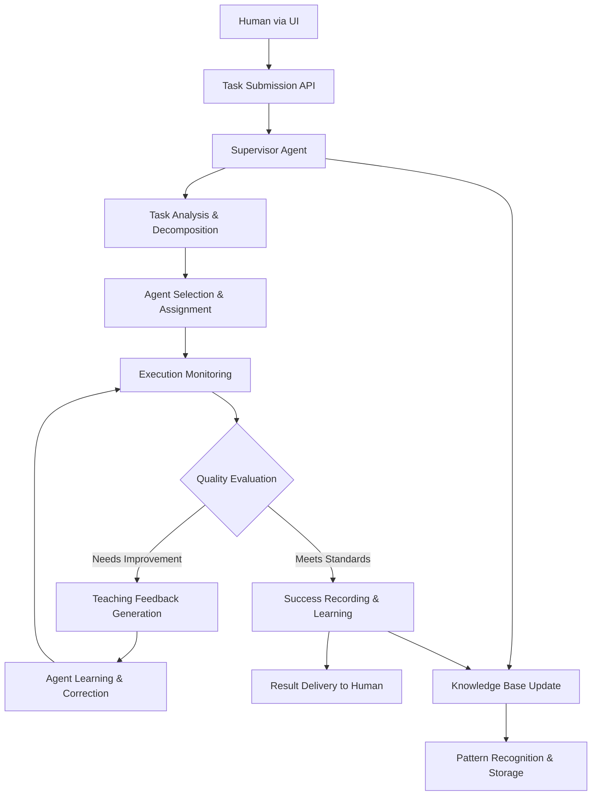

# PyGent Factory Supervisor Agent Architecture Gap Analysis - Phase 5
## Critical Missing Glue: Teacher Agent Layer for Intelligent Task Supervision

**Research Date**: 2025-01-27  
**Objective**: Identify architectural gaps in human-system-agent interaction  
**Status**: ✅ CRITICAL SUPERVISOR AGENT LAYER GAP IDENTIFIED

---

## 🚨 CRITICAL ARCHITECTURAL FLAW DISCOVERED

### **THE FUNDAMENTAL PROBLEM:**

**Current Broken Architecture**:
```
Human → UI → Backend → Raw Agents → Direct Execution
```

**Missing Intelligence Layer**:
```
Human → UI → Backend → SUPERVISOR AGENT → Managed Agents → Guided Execution
```

### **WHY THIS IS A SYSTEM-BREAKING ISSUE:**

#### **1. NO QUALITY CONTROL MECHANISM**
- Agents execute tasks without oversight
- No correction system for poor outputs  
- No learning from mistakes or failures
- No progressive improvement capability

#### **2. DIRECT HUMAN-SYSTEM COUPLING**
- UI sends tasks directly to raw agents
- No intelligent intermediary for task management
- No task decomposition or strategic planning
- No execution monitoring or guidance

#### **3. MISSING TEACHING INFRASTRUCTURE**
- Agents don't learn from experience
- No feedback loop for skill development
- No knowledge transfer between tasks
- No progressive capability building

---

## 🧠 TEACHER AGENT RESEARCH INSIGHTS

### **RECENT BREAKTHROUGH RESEARCH (2024-2025)**

#### **TEACHER AGENT PARADIGM SHIFT**
- **Core Innovation**: Supervisor agents that guide and correct other agents
- **Key Principle**: Teaching through demonstration and correction, not direct problem-solving
- **Major Advantage**: Scalable learning without massive GPU farms or foundation model training

#### **CRITICAL DISTINCTION FROM CURRENT APPROACH**

**❌ WRONG: Direct Problem Solving (Current PyGent Factory)**
```python
def handle_task(task):
    agent = create_agent(task.type)
    result = agent.execute(task)
    return result  # No learning, no improvement, no oversight
```

**✅ RIGHT: Supervised Learning Approach**
```python
def handle_task(task):
    supervisor = SupervisorAgent()
    agent = supervisor.select_appropriate_agent(task)
    
    while not supervisor.is_satisfactory(result):
        feedback = supervisor.generate_teaching_feedback(result, task)
        agent.learn_from_feedback(feedback)
        result = agent.retry_with_guidance(task, feedback)
    
    supervisor.record_success_pattern(agent, task, result)
    return result
```

---

## 🎯 SUPERVISOR AGENT LAYER SPECIFICATIONS

### **COMPONENT 1: TASK INTELLIGENCE SYSTEM**

```python
class TaskIntelligenceSystem:
    def analyze_task_complexity(self, task: str) -> ComplexityAnalysis:
        """Determine task difficulty and requirements"""
        
    def decompose_into_subtasks(self, task: str) -> List[SubTask]:
        """Break complex tasks into manageable steps"""
        
    def identify_required_capabilities(self, task: str) -> List[Capability]:
        """Determine what agent skills are needed"""
        
    def create_execution_strategy(self, subtasks: List[SubTask]) -> ExecutionPlan:
        """Define optimal approach for task completion"""
```

### **COMPONENT 2: AGENT MANAGEMENT SYSTEM**

```python
class AgentManagementSystem:
    def select_optimal_agents(self, capabilities: List[Capability]) -> List[Agent]:
        """Choose best agents for each capability requirement"""
        
    def coordinate_multi_agent_execution(self, agents: List[Agent], plan: ExecutionPlan):
        """Orchestrate collaboration between multiple agents"""
        
    def monitor_agent_performance(self, agent: Agent, task: Task) -> PerformanceMetrics:
        """Real-time tracking of agent execution quality"""
        
    def detect_execution_issues(self, metrics: PerformanceMetrics) -> List[Issue]:
        """Identify problems before they become failures"""
```

### **COMPONENT 3: TEACHING & CORRECTION SYSTEM**

```python
class TeachingSystem:
    def evaluate_output_quality(self, output: Any, standards: QualityStandards) -> QualityScore:
        """Assess if agent output meets requirements"""
        
    def generate_corrective_feedback(self, output: Any, issues: List[Issue]) -> TeachingFeedback:
        """Create guidance for improvement, not direct fixes"""
        
    def provide_learning_examples(self, agent: Agent, skill_gap: SkillGap) -> List[Example]:
        """Show agent successful patterns to emulate"""
        
    def track_learning_progress(self, agent: Agent) -> LearningMetrics:
        """Monitor agent skill development over time"""
```

---

## 🔧 IMPLEMENTATION ARCHITECTURE

### **NEW SYSTEM FLOW WITH SUPERVISOR LAYER**



### **SUPERVISOR AGENT RESPONSIBILITIES**

#### **PRE-EXECUTION PHASE:**
1. **Task Analysis**: Understand complexity, requirements, and success criteria
2. **Strategic Planning**: Decompose into optimal subtask sequence
3. **Agent Selection**: Choose agents based on capabilities and past performance
4. **Resource Allocation**: Assign computational resources and time limits

#### **EXECUTION PHASE:**
1. **Real-time Monitoring**: Track agent progress and output quality
2. **Early Issue Detection**: Identify problems before they cascade
3. **Dynamic Guidance**: Provide corrective feedback without taking over
4. **Coordination Management**: Ensure multi-agent collaboration effectiveness

#### **POST-EXECUTION PHASE:**
1. **Quality Assessment**: Evaluate final output against standards
2. **Learning Facilitation**: Generate improvement feedback for agents
3. **Pattern Recording**: Store successful approaches for future use
4. **Capability Updates**: Update agent skill profiles based on performance

---

## 💡 COST-EFFECTIVE TEACHING STRATEGIES

### **STRATEGY 1: PATTERN-BASED LEARNING**
Instead of expensive foundation model training:

```python
class PatternBasedTeacher:
    def teach_by_successful_examples(self, agent: Agent, examples: List[SuccessExample]):
        """Show agent proven successful patterns"""
        
    def correct_by_comparison(self, agent_output: Output, reference_output: Output):
        """Guide agent to identify and fix differences"""
        
    def build_pattern_library(self, successful_executions: List[Execution]):
        """Create reusable success templates"""
```

### **STRATEGY 2: INCREMENTAL SKILL BUILDING**

```python
class IncrementalSkillBuilder:
    def start_with_achievable_tasks(self, agent: Agent) -> List[SimpleTask]:
        """Begin with tasks agent can successfully complete"""
        
    def gradually_increase_complexity(self, agent: Agent, success_rate: float):
        """Progressive difficulty based on demonstrated competence"""
        
    def create_skill_progression_path(self, agent: Agent, target_capability: Capability):
        """Design learning curriculum for specific skills"""
```

### **STRATEGY 3: PEER LEARNING NETWORKS**

```python
class PeerLearningSystem:
    def create_mentor_relationships(self, expert_agent: Agent, novice_agent: Agent):
        """Experienced agents guide newer ones"""
        
    def facilitate_knowledge_sharing(self, agent_group: List[Agent]):
        """Enable agents to learn from each other's successes"""
        
    def cross_pollinate_capabilities(self, source_agent: Agent, target_agents: List[Agent]):
        """Transfer successful patterns across agent types"""
```

---

## 🚀 IMPLEMENTATION ROADMAP

### **PHASE 1: SUPERVISOR CORE INFRASTRUCTURE (IMMEDIATE - 1 WEEK)**
1. **SupervisorAgent Base Class**: Core orchestration and monitoring
2. **Task Analysis Engine**: Complexity assessment and decomposition
3. **Quality Evaluation System**: Output assessment and standards checking
4. **Basic Teaching Feedback**: Simple correction and guidance generation

### **PHASE 2: UI INTEGRATION & MONITORING (SHORT-TERM - 2 WEEKS)**
1. **UI Route Modification**: All tasks flow through supervisor layer
2. **Real-time Progress Dashboard**: Visual monitoring of supervised execution
3. **Learning Progress Visualization**: Agent improvement tracking
4. **Human Override Controls**: Manual intervention capabilities

### **PHASE 3: ADVANCED TEACHING CAPABILITIES (MEDIUM-TERM - 1 MONTH)**
1. **Pattern Recognition System**: Automated success pattern identification
2. **Curriculum Generation**: Automated learning path creation
3. **Multi-Agent Coordination**: Complex task orchestration
4. **Knowledge Transfer Mechanisms**: Cross-agent learning systems

### **PHASE 4: AUTONOMOUS IMPROVEMENT (LONG-TERM - 2 MONTHS)**
1. **Self-Improving Supervisor**: Supervisor learns to teach better
2. **Predictive Quality Assessment**: Anticipate issues before they occur
3. **Dynamic Agent Creation**: Generate specialized agents for specific tasks
4. **Ecosystem Intelligence**: System-wide learning and optimization

---

## 🎯 CRITICAL SUCCESS METRICS

### **SUPERVISOR EFFECTIVENESS INDICATORS:**
1. **Task Success Rate**: Percentage of tasks completed to satisfaction
2. **Agent Learning Velocity**: Speed of agent skill improvement
3. **Quality Consistency**: Reduction in output variance over time
4. **Human Intervention Frequency**: Decreasing need for manual oversight

### **TEACHING SYSTEM PERFORMANCE:**
1. **Correction Effectiveness**: Success rate of feedback-driven improvements
2. **Knowledge Transfer Efficiency**: Speed of skill propagation between agents
3. **Pattern Recognition Accuracy**: Quality of identified success patterns
4. **Learning Retention**: Persistence of agent improvements over time

---

## 💡 STRATEGIC IMPLICATIONS

### **TRANSFORMATION FROM TOOL TO INTELLIGENT SYSTEM:**

#### **BEFORE (Current State):**
- **Static Execution**: Agents perform tasks without learning
- **No Quality Control**: Outputs vary wildly in quality
- **Human Dependency**: Requires constant human oversight
- **No Improvement**: System capabilities remain static

#### **AFTER (With Supervisor Layer):**
- **Adaptive Learning**: Agents continuously improve from experience
- **Consistent Quality**: Supervised outputs meet defined standards
- **Autonomous Operation**: Reduced need for human intervention
- **Exponential Improvement**: System capabilities grow over time

### **COMPETITIVE ADVANTAGE:**
This Supervisor Agent layer transforms PyGent Factory from a "task execution tool" into a "learning organization" that becomes more valuable with every use.

---

## 🎯 RESEARCH CONCLUSIONS

### **✅ CRITICAL FINDINGS:**
1. **Architectural Gap Confirmed**: Missing supervisor layer is system-breaking flaw
2. **Teacher Agent Paradigm**: Recent research provides cost-effective learning approach
3. **Implementation Feasibility**: Can be built without expensive GPU farms
4. **Transformational Impact**: Changes system from tool to intelligent assistant

### **🚀 IMMEDIATE PRIORITIES:**
1. **Design Supervisor Agent Architecture**: Core orchestration and monitoring
2. **Implement Teaching Feedback System**: Agent correction and guidance
3. **Create Quality Evaluation Framework**: Output assessment and standards
4. **Build Learning Progress Tracking**: Agent improvement monitoring

### **💡 STRATEGIC INSIGHT:**
The Supervisor Agent layer is not just a missing feature - it's the **fundamental difference between a task executor and an intelligent system**. This layer enables PyGent Factory to evolve from a static tool into a continuously improving AI assistant.

---

**Research Status**: PHASE 5 COMPLETE - SUPERVISOR AGENT ARCHITECTURE REQUIREMENTS DOCUMENTED  
**Next Action**: Begin implementation of Supervisor Agent core infrastructure with teaching capabilities
